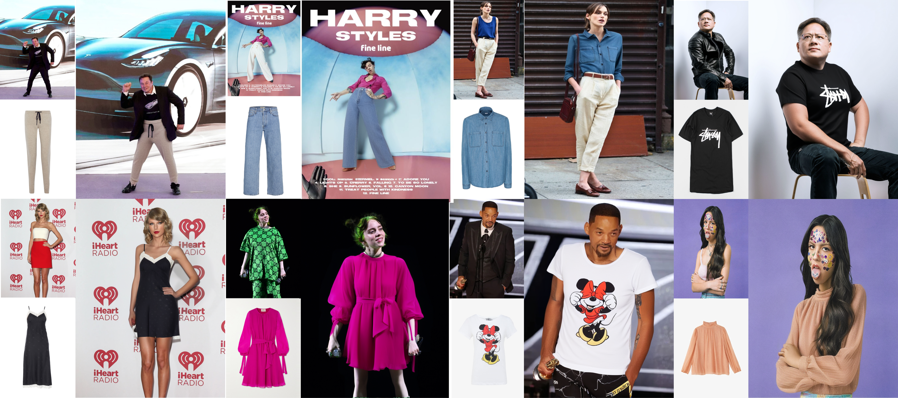
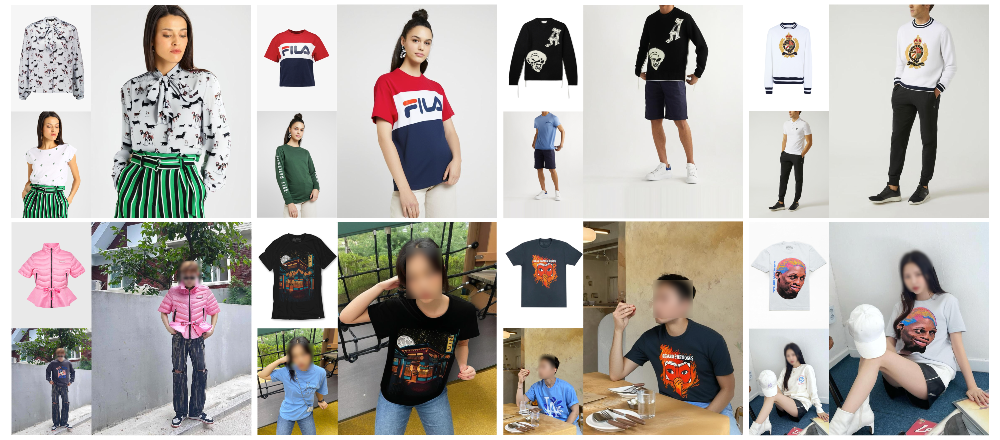

<div align="center">
<h1>IDM-VTON: Improving Diffusion Models for Authentic Virtual Try-on in the Wild</h1>

<a href='https://idm-vton.github.io'></a>
<a href='https://arxiv.org/abs/2403.05139'></a>
<a href='https://huggingface.co/spaces/yisol/IDM-VTON'></a>
<a href='https://huggingface.co/yisol/IDM-VTON'></a>


</div>

This is the official implementation of the paper ["Improving Diffusion Models for Authentic Virtual Try-on in the Wild"](https://arxiv.org/abs/2403.05139).

Star ⭐ us if you like it!

---


&nbsp;
&nbsp;


## Requirements

```
git clone https://github.com/yisol/IDM-VTON.git
cd IDM-VTON

conda env create -f environment.yaml
conda activate idm
```

## Data preparation

### VITON-HD
You can download VITON-HD dataset from [VITON-HD](https://github.com/shadow2496/VITON-HD).

After download VITON-HD dataset, move vitonhd_test_tagged.json into the test folder, and move vitonhd_train_tagged.json into the train folder.

Structure of the Dataset directory should be as follows.

```

train
|-- image
|-- image-densepose
|-- agnostic-mask
|-- cloth
|-- vitonhd_train_tagged.json

test
|-- image
|-- image-densepose
|-- agnostic-mask
|-- cloth
|-- vitonhd_test_tagged.json

```

### DressCode
You can download DressCode dataset from [DressCode](https://github.com/aimagelab/dress-code).

We provide pre-computed densepose images and captions for garments [here](https://kaistackr-my.sharepoint.com/:u:/g/personal/cpis7_kaist_ac_kr/EaIPRG-aiRRIopz9i002FOwBDa-0-BHUKVZ7Ia5yAVVG3A?e=YxkAip).

We used [detectron2](https://github.com/facebookresearch/detectron2) for obtaining densepose images, refer [here](https://github.com/sangyun884/HR-VITON/issues/45) for more details.

After download the DressCode dataset, place image-densepose directories and caption text files as follows.

```
DressCode
|-- dresses
    |-- images
    |-- image-densepose
    |-- dc_caption.txt
    |-- ...
|-- lower_body
    |-- images
    |-- image-densepose
    |-- dc_caption.txt
    |-- ...
|-- upper_body
    |-- images
    |-- image-densepose
    |-- dc_caption.txt
    |-- ...
```


## Training


### Preparation

Download pre-trained ip-adapter for sdxl(IP-Adapter/sdxl_models/ip-adapter-plus_sdxl_vit-h.bin) and image encoder(IP-Adapter/models/image_encoder) [here](https://github.com/tencent-ailab/IP-Adapter).

```
git clone https://huggingface.co/h94/IP-Adapter
```

Move ip-adapter to ckpt/ip_adapter, and image encoder to ckpt/image_encoder.

Start training using python file with arguments,

```
accelerate launch train_xl.py \
    --gradient_checkpointing --use_8bit_adam \
    --output_dir=result --train_batch_size=6 \
    --data_dir=DATA_DIR
```

or, you can simply run with the script file.

```
sh train_xl.sh
```


## Inference


### VITON-HD

Inference using python file with arguments,

```
accelerate launch inference.py \
    --width 768 --height 1024 --num_inference_steps 30 \
    --output_dir "result" \
    --unpaired \
    --data_dir "DATA_DIR" \
    --seed 42 \
    --test_batch_size 2 \
    --guidance_scale 2.0
```

or, you can simply run with the script file.

```
sh inference.sh
```

### DressCode

For DressCode dataset, put the category you want to generate images via category argument,
```
accelerate launch inference_dc.py \
    --width 768 --height 1024 --num_inference_steps 30 \
    --output_dir "result" \
    --unpaired \
    --data_dir "DATA_DIR" \
    --seed 42 
    --test_batch_size 2
    --guidance_scale 2.0
    --category "upper_body" 
```

or, you can simply run with the script file.
```
sh inference.sh
```

## Start a local gradio demo <a href='https://github.com/gradio-app/gradio'></a>

Download checkpoints for human parsing [here](https://huggingface.co/spaces/yisol/IDM-VTON/tree/main/ckpt).

Place the checkpoints under the ckpt folder.
```
ckpt
|-- densepose
    |-- model_final_162be9.pkl
|-- humanparsing
    |-- parsing_atr.onnx
    |-- parsing_lip.onnx

|-- openpose
    |-- ckpts
        |-- body_pose_model.pth
    
```


Run the following command:

```python
python gradio_demo/app.py
```

## Start the web UI with remote Colab inference

The repo also includes a custom browser-based demo that can run locally while forwarding inference to a Colab machine.

### 1. Run the API bridge on Colab

Inside the Colab runtime where IDM-VTON can actually run:

```python
python web_demo/colab_bridge.py --host 0.0.0.0 --port 7862
```

### 1. Mở cổng `7862` ra internet

Dùng Cloudflare Tunnel hoặc ngrok để expose port `7862` từ máy Colab. Nếu dùng notebook mẫu đi kèm, Cloudflare Tunnel là lựa chọn dễ nhất vì không cần auth token.

Sau khi tunnel chạy, bạn sẽ nhận được public URL dạng:

```text
https://xxxx.trycloudflare.com
```

### 2. Kiểm tra API bridge

API bridge hỗ trợ hai endpoint:

- `GET /api/health`
- `POST /api/tryon`

Khi bridge vừa khởi động, `/api/health` có thể trả `modelStatus: "loading"` và `modelReady: false`. Khi model đã sẵn sàng, nó sẽ trả `modelStatus: "ready"` và `modelReady: true`.

`POST /api/tryon` nhận `multipart/form-data` với `human_image` và `garment_image`, thêm các trường tuỳ chọn như `mask_image`, `garment_description`, `auto_mask`, `auto_crop`, `denoise_steps`, và `seed`. Kết quả trả về JSON có `seed`, `outputImage`, `maskPreview`; các ảnh trả về là PNG data URL.

### 3. Chạy web UI ở máy local

On your own machine:

```python
python web_demo/server.py --host 127.0.0.1 --port 7861
```

Tuỳ chọn: truyền luôn URL Colab từ dòng lệnh:

```python
python web_demo/server.py --host 127.0.0.1 --port 7861 --remote-url https://your-public-colab-url
```

### 4. Mở trang web và dán URL

Mở:

```text
http://127.0.0.1:7861
```

Sau đó dán public URL của Colab vào ô `Colab API URL`. Nếu bạn chỉ dán base URL, giao diện local sẽ tự thêm `/api/tryon` khi chạy thử đồ.

### 5. Lưu ý

- The local web UI only serves static assets and proxies requests; it does not load the model.
- The Colab bridge reuses the same IDM-VTON pipeline and returns `outputImage`, `maskPreview`, and `seed` as JSON.
- This is the recommended path when your machine cannot run IDM-VTON locally.


## Acknowledgements


Thanks [ZeroGPU](https://huggingface.co/zero-gpu-explorers) for providing free GPU.

Thanks [IP-Adapter](https://github.com/tencent-ailab/IP-Adapter) for base codes.

Thanks [OOTDiffusion](https://github.com/levihsu/OOTDiffusion) and [DCI-VTON](https://github.com/bcmi/DCI-VTON-Virtual-Try-On) for masking generation.

Thanks [SCHP](https://github.com/GoGoDuck912/Self-Correction-Human-Parsing) for human segmentation.

Thanks [Densepose](https://github.com/facebookresearch/DensePose) for human densepose.


## Star History

[](https://star-history.com/#yisol/IDM-VTON&Date)


## Citation
```
@article{choi2024improving,
  title={Improving Diffusion Models for Authentic Virtual Try-on in the Wild},
  author={Choi, Yisol and Kwak, Sangkyung and Lee, Kyungmin and Choi, Hyungwon and Shin, Jinwoo},
  journal={arXiv preprint arXiv:2403.05139},
  year={2024}
}
```


## License
The codes and checkpoints in this repository are under the [CC BY-NC-SA 4.0 license](https://creativecommons.org/licenses/by-nc-sa/4.0/legalcode).


